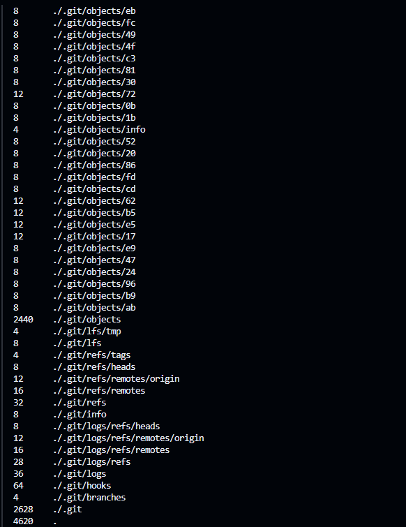

# Net&Sys Assignment: Running Containers for Application Development

Group Name: __BilisMerah__. 

Team Mates:
1. __Muhammad Alif Haziq Bin Mohd Razmi__ __(2110091)__
2. __Muhammad Aliff Iman Bin Abd Rasid__ __(2110487)__


## Rules
1. You are allowed to have **3 group** members.
2. When you complete the assignment, make sure to submit the repository link of your cloned project. Make sure all the files are as what you aspect in your repository. 
3. Answer all questions in the **README.md**, in your own repository. Either use the online VSCode, terminal or github to edit. Answers are expected where you see __Fill answer here__.
4. Learn how to use markdown. https://www.w3schools.io/file/markdown-introduction/

## Forking this project repository
1. First thing you need in doing this assignment is to have a github account. Make sure to sign up at https://www.github.com
2. The second thing you need is to fork the Net&Sys Assignment repository in your own github account. 

    1. Go to https://github.com/ZainabBashi/NatSysProject and click fork to copy the project into your own repository
    2. Make sure that the new fork is now in your own repository

***Questions:***

1. What is the link of the fork Net&Sys Assignment in your repository. ***(1 mark)*** __https://github.com/LipJiq/NatSysProject.git__.
2. How many files and folders are in this repository. ***(1 mark)*** __Fill answer here__.


## Exploring github codespaces

1. The next thing that we will be doing is exploring codespaces. First of all, read about codespaces https://docs.github.com/en/codespaces/overview#what-is-a-codespace
2. Then go to the link https://github.com/codespaces and we shall start a new codespace.  
3. Click on ***New codespace***.
4. Choose your own Net&Sys Assignment repository to start your codespace.

 

5. Once you have created you codespace, you will see the following. You might already be familiar with this, since it will look similar to VSCode. 

 

6. You will see the [README file](./README.md) file. One is a preview of how it looks like on the web, and the other is the editing view in markdown language. 
7. Edit the [README file](./README.md). Make sure you have your group details correct, ie, group name and team members along with their matric Numbers. 
8. Once you have finish editing, click File->Save or ***ctrl-s*** to save it. 
9. After saving, you will notice an M or U next to your file. You will need to commit any changes, whenever you make changes so that it is uploaded to the github repository. 

 

10. Click on the source control, hint: its on the left side panel, and it will list down the files that have been modified or updated. Click on commit. It will then ask you "Would you like to stage all your changes and commit them directly?" Just say yes, and a new tab will appear. Type a message to log what you have done, and click on the check mark. 

 

11. After that, sync the changes to the main repository. 
12. Make sure to commit and sync your files to the main repository, or else, your work will be lost since it is not saved into the main repository when you submit your project.

***Questions:***

1. What is default OS used to run the virtual environment for codespaces. ***(1 mark)*** __Linux - Ubuntu__.
2. What are the two options of RAM, disk and vcpu configuration you can have in running codespaces . ***(1 mark)*** __Fill answer here__.
3. Why must we commit and sync our current work on source control? ***(1 mark)*** __Fill answer here__.

## Exploring the Terminal

1. Look at the TERMINAL tab. Explore and run commands according to the questions below. 
2. You can include your answers as images, or cut and paste the output here. If you are cutting and pasting your answers, wrap your answers in the codeblock clause in markdown. For example, if i run the command **whoami** the the output would look like the one below.
```bash
@joeynor ➜ /workspaces/OSProject (main) $ whoami 
codespace
```


***Questions:***

Look at the TERMINAL tab. Run the following commands and provide the output here. 

1. Run the command **pwd** . ***(1 mark)*** .

    
2. Run the command **cat /etc/passwd** . ***(1 mark)*** .

    
3. Run the command **df** . ***(1 mark)*** .

    
4. Run the command **du** . ***(1 mark)*** .

    

    
5. Run the command **ls** . ***(1 mark)*** .

    
6. Run the command **ls -asl** . ***(1 mark)*** .

    
7. Run the command **free -h** . ***(1 mark)*** .

    
8. Run the command **cat /proc/cpuinfo** . ***(1 mark)*** .

    

    
9. Run the command **top** and type **q** to quit. ***(1 mark)*** .

    
10. Run the command **uname -a**. ***(1 mark)*** .

    
11. What is the available free memory in the system. ***(1 mark)*** 

    __- The available free memory is 357Mi__.

12. What is the available disk space mounted on /workspace. ***(1 mark)*** 

    __- The available disk space mounted on /workspace is 16673996 1K-block (approximate 15.9 Gi - 16 Gi)__.

13. Name the version and hardware architecture of the linux Virtual environment. ***(1 mark)*** 

    __- The version is 6.5.0-1021-azure while x86_64 is the hardware architecture__.

14. What is the difference between **ls** vs **ls -asl**. ***(1 mark)*** 

    __- "ls": This command lists the files and directories in the current directory without any additional information. It typically shows just the names of the files and directories__.

    __- "ls -asl": This command provides a more detailed listing.__

    __Breaking down the options:__

    __-a: Shows all files, including hidden files (those whose names begin with a dot .).__

    __-s: Displays the size of each file in blocks.__

    __-l: Uses a long listing format, which includes additional details such as permissions, number of links, owner, group, size, and last modification time for each file.__

15. What is the TLB size of the Virtual CPU. ***(1 mark)*** 

    __- The TLB size of the virtual CPU is 2560 4K pages for processor 0 and 1__.

16. What is the CPU speed of the Virtual CPU. ***(1 mark)*** 

    __- The CPU speed is 2422.575 MHz for processor 0 while for processor 1 it is 2414.454 MHz__.

17. What is the top running process that consumes the most CPU cycles. ***(1 mark)*** 

    __- The top running process that consume the most CPU cycles is PID 546 which is node with 1.3%__.

## Running your own container instance.

1. At the terminal, run a linux instance. By typing the following command. 
```
docker pull debian
docker run --detach -it debian
```
2. This will run the debian container. To check if the debian container is running, type
```bash
@joeynor ➜ /workspaces/OSProject (main) $ docker ps -a
CONTAINER ID   IMAGE     COMMAND   CREATED         STATUS         PORTS     NAMES
f65be1987f84   debian    "bash"    4 minutes ago   Up 4 minutes             romantic_jackson
```

3. Keep note of the name used by your container, this is usually given random names unless you specify your own name. Now run a bash command on the container. Make sure you use the name of your container instead of the one shown here. 
```bash
docker exec -i -t romantic_jackson /bin/bash
```

4. Create a file on the container. First you must make sure you are in the bash command prompt of the container. The container is new, and does not have any software other than the debian OS. To create a new file, you will need an editor installed. In the bash shell of the container, run the package manager apt-get to install nano text editor. 

```bash
root@f65be1987f84:~# apt-get update      

root@f65be1987f84:~# apt-get install nano

root@f65be1987f84:~# cd /root

root@f65be1987f84:~# nano helloworld.txt
```

5. Edit your helloworld.txt, create your messsage and save by typing ctrl-X. Once saved, explore using the container to see where the file is located. Then exit the shell, by typing **exit**.

6. Stop the container and run **docker ps -a**, and restart the container again. Is your file in the container still available?
```bash 
@joeynor ➜ /workspaces/OSProject (main) $ docker stop romantic_jackson

@joeynor ➜ /workspaces/OSProject (main) $ docker ps -a
CONTAINER ID   IMAGE     COMMAND   CREATED          STATUS                        PORTS     NAMES
f65be1987f84   debian    "bash"    19 minutes ago   Exited (137) 18 seconds ago             romantic_jackson

@joeynor ➜ /workspaces/OSProject (main) $ docker restart romantic_jackson
```

7. Stop the container and delete the container. What happened to your helloworld.txt?

```bash 
@joeynor ➜ /workspaces/OSProject (main) $ docker stop romantic_jackson

@joeynor ➜ /workspaces/OSProject (main) $ docker ps -a
CONTAINER ID   IMAGE     COMMAND   CREATED          STATUS                        PORTS     NAMES
f65be1987f84   debian    "bash"    19 minutes ago   Exited (137) 18 seconds ago             romantic_jackson

@joeynor ➜ /workspaces/OSProject (main) $ docker rm romantic_jackson
```

***Questions:***

1. Are files in the container persistent. Why not?. ***(1 mark)*** 

    __- The files in the container are not persistent because by default, any changes made to the filesystem of a container are lost when the container is removed. This ephemeral nature of containers means that any data created during the container's runtime will be deleted once the container stops and is removed__.

2. Can we run two, or three instances of debian linux? . ***(1 mark)*** 

    __- Yes, we can run multiple instances of Debian Linux, either as separate Docker containers or as virtual machines (VMs)__.

## Running your own container with persistent storage

1. In the previous experiment, you might have notice that containers are not persistent. To make storage persistent, you will need to mount them. 
At the terminal, create a new directory called **myroot**, and run a instance of debian linux and mount myroot to the container. Find out the exact path of my root, and mount it as the root folder in the debian container. 
2. Create a file in /root on the container, the files should also appear in myroot of your host VM.

```bash 
@joeynor ➜ /workspaces/OSProject (main) $ mkdir myroot
@joeynor ➜ /workspaces/OSProject (main) $ cd myroot/
@joeynor ➜ /workspaces/OSProject/myroot (main) $ pwd
/workspaces/OSProject/myroot

@joeynor ➜ /workspaces/OSProject/myroot (main) $ docker run --detach -it -v /workspaces/OSProject/myroot:/root debian
```

***Questions:***

1. Check the permission of the files created in myroot, what user and group is the files created in docker container on the host virtual machine? . ***(2 mark)*** 
```bash 
@LipJiq ➜ /workspaces/NatSysProject/myroot (main) $ docker run --detach -it -v /workspaces/NatSysProject/myroot:/root debian
1b87f0c4d53beebd6aeb596210808bd4402b916c3ceb365eb18a68de272d27d8

@LipJiq ➜ /workspaces/NatSysProject/myroot (main) $ docker ps -a
CONTAINER ID   IMAGE     COMMAND   CREATED         STATUS         PORTS     NAMES
1b87f0c4d53b   debian    "bash"    9 minutes ago   Up 9 minutes             affectionate_mayer

@LipJiq ➜ /workspaces/NatSysProject/myroot (main) $ docker exec -i -t affectionate_mayer /bin/bash

root@1b87f0c4d53b:/# cd /root
root@1b87f0c4d53b:~# nano bilismerah.txt
root@1b87f0c4d53b:~# exit

@LipJiq ➜ /workspaces/NatSysProject/myroot (main) $ ls -asl
total 16
4 drwxrwxrwx+ 3 codespace codespace 4096 May 24 15:08 .
4 drwxrwxrwx+ 5 codespace root      4096 May 24 14:42 ..
4 drwxrwxrwx+ 3 root      root      4096 May 24 15:05 .local
4 -rw-rw-rw-  1 root      root       171 May 24 15:07 bilismerah.txt
```
2. Can you change the permission of the files to user codespace.  You will need this to be able to commit and get points for this question. ***(2 mark)***
```bash
//use sudo and chown
sudo chown -R codespace:codespace myroot

```
*** __Fill answer here__.***
```bash
@LipJiq ➜ /workspaces/NatSysProject/myroot (main) $ ls -asl
total 16
4 drwxrwxrwx+ 3 codespace codespace 4096 May 24 15:44 .
4 drwxrwxrwx+ 5 codespace root      4096 May 24 14:42 ..
4 drwxrwxrwx+ 3 root      root      4096 May 24 15:05 .local
4 -rw-rw-rw-  1 root      root       171 May 24 15:07 bilismerah.txt

@LipJiq ➜ /workspaces/NatSysProject/myroot (main) $ chmod u+x bilismerah.txt
chmod: changing permissions of 'bilismerah.txt': Operation not permitted

@LipJiq ➜ /workspaces/NatSysProject/myroot (main) $ cd ..
@LipJiq ➜ /workspaces/NatSysProject (main) $ sudo chown -R codespace:codespace myroot

@LipJiq ➜ /workspaces/NatSysProject (main) $ cd myroot
@LipJiq ➜ /workspaces/NatSysProject/myroot (main) $ ls -asl
total 16
4 drwxrwxrwx+ 3 codespace codespace 4096 May 24 15:44 .
4 drwxrwxrwx+ 5 codespace root      4096 May 24 14:42 ..
4 drwxrwxrwx+ 3 codespace codespace 4096 May 24 15:05 .local
4 -rw-rw-rw-  1 codespace codespace  171 May 24 15:07 bilismerah.txt

@LipJiq ➜ /workspaces/NatSysProject/myroot (main) $ chmod u+x bilismerah.txt
@LipJiq ➜ /workspaces/NatSysProject/myroot (main) $ ls -asl
total 16
4 drwxrwxrwx+ 3 codespace codespace 4096 May 24 15:44 .
4 drwxrwxrwx+ 5 codespace root      4096 May 24 14:42 ..
4 drwxrwxrwx+ 3 codespace codespace 4096 May 24 15:05 .local
4 -rwxrw-rw-  1 codespace codespace  171 May 24 15:07 bilismerah.txt

```

## You are on your own, create your own static webpage

1. Create a directory called webpage in your host machine
2. Inside the directory, create a page index.html, with any content you would like
```
@Alepiimanz ➜ /workspaces/NatSysProject (main) $ mkdir webpage
@Alepiimanz ➜ /workspaces/NatSysProject (main) $ cd webpage
@Alepiimanz ➜ /workspaces/NatSysProject/webpage (main) $ touch index.html
```
3. Then, run the apache webserver and mount the webpage directory to it. Hint:
```bash
## the -p 8080:80 flag points the host port 8080 to the container port 80

docker run --detach -v /workspaces/OSProject/webpage:/usr/local/apache2/htdocs/ -p 8080:80 httpd
```
```
@Alepiimanz ➜ /workspaces/NatSysProject/webpage (main) $ pwd 
/workspaces/NatSysProject/webpage
@Alepiimanz ➜ /workspaces/NatSysProject/webpage (main) $ docker run --detach -v /workspaces/OSProject/webpage:/usr/local/apache2/htdocs/ -p 8080:80 httpd
Unable to find image 'httpd:latest' locally
latest: Pulling from library/httpd
09f376ebb190: Pulling fs layer 
dab55b4abfc3: Pulling fs layer 
4f4fb700ef54: Pull complete 
1a6d0283f224: Pull complete 
1abf9110528c: Pull complete 
7bacb8f85f3a: Pull complete 
Digest: sha256:43c7661a3243c04b0955c81ac994ea13a1d8a1e53c15023a7b3cd5e8bb25de3c
Status: Downloaded newer image for httpd:latest
2fe007262a391f854f1073b77a4cb78571e120416cfc67975feefe5655d1ac10
```
4. If it works, codespace will trigger a port assignment and provide a URL for you to access your webpage like the one below.

 


5. You can also see the Port in the **PORTS** tab, next to the terminal tab.

6. You can then access your website by adding an index.html towards the end of your url link, like the one below. 

 

***Questions:***

1. What is the permission of folder /usr/local/apache/htdocs and what user and group owns the folder? . ***(2 mark)*** __Everyone can read and write at all files but cannot execute them. The user id for the owner is 1000 and group id is 1000 where it belongs to codespace__.
2. What port is the apache web server running. ***(1 mark)*** port 80
3. What port is open for http protocol on the host machine? ***(1 mark)*** port 8080

## Create SUB Networks

1. In docker, you can create your own private networks where you can run multiple services, in this part, we will create two networks, one called bluenet and the other is rednet
2. Run the docker create network to create you networks like the ones below
```bash
## STEP 1:
## Create Networks ##
docker network create bluenet
docker network create rednet`

## STEP 2: (automatically running)
## Create (1) Container in background called "c1" running busybox image ##
docker run -itd --net bluenet --name c1 busybox sh
docker run -itd --net rednet --name c2 busybox sh
```

```bash
@LipJiq ➜ /workspaces/NatSysProject/myroot (main) $ docker network create bluenet
7659b036408fdc4e4a4a615d0b3521128cb0feb18e767c1fce1af892382078cf

@LipJiq ➜ /workspaces/NatSysProject/myroot (main) $ docker network create rednet
c38e0c04e87199a493c25ee46a07af694d52e8dd7e4b4b3363c3415175782ded

@LipJiq ➜ /workspaces/NatSysProject/myroot (main) $ docker run -itd --net bluenet --name c1 busybox sh
Unable to find image 'busybox:latest' locally
latest: Pulling from library/busybox
ec562eabd705: Pull complete 
Digest: sha256:5eef5ed34e1e1ff0a4ae850395cbf665c4de6b4b83a32a0bc7bcb998e24e7bbb
Status: Downloaded newer image for busybox:latest
cacaf66fc33262802cd8e70ea0b3aed6bff2f03ad45a9ac4e6293a06cea4ae67

@LipJiq ➜ /workspaces/NatSysProject/myroot (main) $ docker run -itd --net rednet --name c2 busybox sh
c9d1303c0e3e35ab7fae69261bbdfef88ff66fa8d6230133706bc6933688a6b6
```
***Questions:***

1. Describe what is busybox and what is command switch **--name** is for? . ***(2 mark)*** 

    __- BusyBox is a single executable that provides a collection of several standard Unix utilities in a single small executable. It's commonly used in embedded systems and environments with limited resources, where having a full set of separate utility binaries might be impractical due to space constraints. BusyBox includes implementations of many common Unix utilities, such as ls, grep, cp, mv, rm, cat, chmod, chown, and more__.

    __- The --name command switch is not specific to BusyBox itself, but rather a general command-line option used in various contexts to specify a name or identifier for a resource. However, in the context of BusyBox or containerization platforms like Docker, the --name option is typically used when creating or running a container to assign a specific name to the container instance__.

2. Explore the network using the command ```docker network ls```, show the output of your terminal. ***(1 mark)***

```bash
@LipJiq ➜ /workspaces/NatSysProject/myroot (main) $ docker network ls
NETWORK ID     NAME      DRIVER    SCOPE
7659b036408f   bluenet   bridge    local
861bbcf594e5   bridge    bridge    local
0d1b3df49e0f   host      host      local
a43df4244db8   none      null      local
c38e0c04e871   rednet    bridge    local
```
3. Using ```docker inspect c1``` and ```docker inspect c2``` inscpect the two network. What is the gateway of bluenet and rednet.? ***(1 mark)***
    __- The gateway for bluenet is 172.18.0.1 while rednet is 172.19.0.1__.

c1
```bash
@LipJiq ➜ /workspaces/NatSysProject/myroot (main) $ docker inspect c1
[
    {
        "Id": "cacaf66fc33262802cd8e70ea0b3aed6bff2f03ad45a9ac4e6293a06cea4ae67",
        "Created": "2024-05-24T17:20:04.43818148Z",
        "Path": "sh",
        "Args": [],
        "State": {
            "Status": "running",
            "Running": true,
            "Paused": false,
            "Restarting": false,
            "OOMKilled": false,
            "Dead": false,
            "Pid": 17044,
            "ExitCode": 0,
            "Error": "",
            "StartedAt": "2024-05-24T17:20:05.132076512Z",
            "FinishedAt": "0001-01-01T00:00:00Z"
        },
        "Image": "sha256:65ad0d468eb1c558bf7f4e64e790f586e9eda649ee9f130cd0e835b292bbc5ac",
        "ResolvConfPath": "/var/lib/docker/containers/cacaf66fc33262802cd8e70ea0b3aed6bff2f03ad45a9ac4e6293a06cea4ae67/resolv.conf",
        "HostnamePath": "/var/lib/docker/containers/cacaf66fc33262802cd8e70ea0b3aed6bff2f03ad45a9ac4e6293a06cea4ae67/hostname",
        "HostsPath": "/var/lib/docker/containers/cacaf66fc33262802cd8e70ea0b3aed6bff2f03ad45a9ac4e6293a06cea4ae67/hosts",
        "LogPath": "/var/lib/docker/containers/cacaf66fc33262802cd8e70ea0b3aed6bff2f03ad45a9ac4e6293a06cea4ae67/cacaf66fc33262802cd8e70ea0b3aed6bff2f03ad45a9ac4e6293a06cea4ae67-json.log",
        "Name": "/c1",
        "RestartCount": 0,
        "Driver": "overlay2",
        "Platform": "linux",
        "MountLabel": "",
        "ProcessLabel": "",
        "AppArmorProfile": "docker-default",
        "ExecIDs": null,
        "HostConfig": {
            "Binds": null,
            "ContainerIDFile": "",
            "LogConfig": {
                "Type": "json-file",
                "Config": {}
            },
            "NetworkMode": "bluenet",
            "PortBindings": {},
            "RestartPolicy": {
                "Name": "no",
                "MaximumRetryCount": 0
            },
            "AutoRemove": false,
            "VolumeDriver": "",
            "VolumesFrom": null,
            "ConsoleSize": [
                24,
                222
            ],
            "CapAdd": null,
            "CapDrop": null,
            "CgroupnsMode": "private",
            "Dns": [],
            "DnsOptions": [],
            "DnsSearch": [],
            "ExtraHosts": null,
            "GroupAdd": null,
            "IpcMode": "private",
            "Cgroup": "",
            "Links": null,
            "OomScoreAdj": 0,
            "PidMode": "",
            "Privileged": false,
            "PublishAllPorts": false,
            "ReadonlyRootfs": false,
            "SecurityOpt": null,
            "UTSMode": "",
            "UsernsMode": "",
            "ShmSize": 67108864,
            "Runtime": "runc",
            "Isolation": "",
            "CpuShares": 0,
            "Memory": 0,
            "NanoCpus": 0,
            "CgroupParent": "",
            "BlkioWeight": 0,
            "BlkioWeightDevice": [],
            "BlkioDeviceReadBps": [],
            "BlkioDeviceWriteBps": [],
            "BlkioDeviceReadIOps": [],
            "BlkioDeviceWriteIOps": [],
            "CpuPeriod": 0,
            "CpuQuota": 0,
            "CpuRealtimePeriod": 0,
            "CpuRealtimeRuntime": 0,
            "CpusetCpus": "",
            "CpusetMems": "",
            "Devices": [],
            "DeviceCgroupRules": null,
            "DeviceRequests": null,
            "MemoryReservation": 0,
            "MemorySwap": 0,
            "MemorySwappiness": null,
            "OomKillDisable": null,
            "PidsLimit": null,
            "Ulimits": null,
            "CpuCount": 0,
            "CpuPercent": 0,
            "IOMaximumIOps": 0,
            "IOMaximumBandwidth": 0,
            "MaskedPaths": [
                "/proc/asound",
                "/proc/acpi",
                "/proc/kcore",
                "/proc/keys",
                "/proc/latency_stats",
                "/proc/timer_list",
                "/proc/timer_stats",
                "/proc/sched_debug",
                "/proc/scsi",
                "/sys/firmware",
                "/sys/devices/virtual/powercap"
            ],
            "ReadonlyPaths": [
                "/proc/bus",
                "/proc/fs",
                "/proc/irq",
                "/proc/sys",
                "/proc/sysrq-trigger"
            ]
        },
        "GraphDriver": {
            "Data": {
                "LowerDir": "/var/lib/docker/overlay2/9b472f68e5b10171ebdf8b5e4e3726a87afed661e382139cee299d978dc7397d-init/diff:/var/lib/docker/overlay2/215b7b50f3a70fe228904ab5ce93b01950d02d5bce453c11804915184bb7c71f/diff",
                "MergedDir": "/var/lib/docker/overlay2/9b472f68e5b10171ebdf8b5e4e3726a87afed661e382139cee299d978dc7397d/merged",
                "UpperDir": "/var/lib/docker/overlay2/9b472f68e5b10171ebdf8b5e4e3726a87afed661e382139cee299d978dc7397d/diff",
                "WorkDir": "/var/lib/docker/overlay2/9b472f68e5b10171ebdf8b5e4e3726a87afed661e382139cee299d978dc7397d/work"
            },
            "Name": "overlay2"
        },
        "Mounts": [],
        "Config": {
            "Hostname": "cacaf66fc332",
            "Domainname": "",
            "User": "",
            "AttachStdin": false,
            "AttachStdout": false,
            "AttachStderr": false,
            "Tty": true,
            "OpenStdin": true,
            "StdinOnce": false,
            "Env": null,
            "Cmd": [
                "sh"
            ],
            "Image": "busybox",
            "Volumes": null,
            "WorkingDir": "",
            "Entrypoint": null,
            "OnBuild": null,
            "Labels": {}
        },
        "NetworkSettings": {
            "Bridge": "",
            "SandboxID": "e0dd1391eef865a37b2bc7bb08ccd752433d2479e2cd63340fce881b80387d90",
            "HairpinMode": false,
            "LinkLocalIPv6Address": "",
            "LinkLocalIPv6PrefixLen": 0,
            "Ports": {},
            "SandboxKey": "/var/run/docker/netns/e0dd1391eef8",
            "SecondaryIPAddresses": null,
            "SecondaryIPv6Addresses": null,
            "EndpointID": "",
            "Gateway": "",
            "GlobalIPv6Address": "",
            "GlobalIPv6PrefixLen": 0,
            "IPAddress": "",
            "IPPrefixLen": 0,
            "IPv6Gateway": "",
            "MacAddress": "",
            "Networks": {
                "bluenet": {
                    "IPAMConfig": null,
                    "Links": null,
                    "Aliases": [
                        "cacaf66fc332"
                    ],
                    "NetworkID": "7659b036408fdc4e4a4a615d0b3521128cb0feb18e767c1fce1af892382078cf",
                    "EndpointID": "543d355bcaf7e51b801c5d7c741f03eaa0611805f0de9373027b639fe4e0a156",
                    "Gateway": "172.18.0.1",
                    "IPAddress": "172.18.0.2",
                    "IPPrefixLen": 16,
                    "IPv6Gateway": "",
                    "GlobalIPv6Address": "",
                    "GlobalIPv6PrefixLen": 0,
                    "MacAddress": "02:42:ac:12:00:02",
                    "DriverOpts": null
                }
            }
        }
    }
]
```

c2
```bash
@LipJiq ➜ /workspaces/NatSysProject/myroot (main) $ docker inspect c2
[
    {
        "Id": "c9d1303c0e3e35ab7fae69261bbdfef88ff66fa8d6230133706bc6933688a6b6",
        "Created": "2024-05-24T17:21:18.379646946Z",
        "Path": "sh",
        "Args": [],
        "State": {
            "Status": "running",
            "Running": true,
            "Paused": false,
            "Restarting": false,
            "OOMKilled": false,
            "Dead": false,
            "Pid": 17572,
            "ExitCode": 0,
            "Error": "",
            "StartedAt": "2024-05-24T17:21:18.829650396Z",
            "FinishedAt": "0001-01-01T00:00:00Z"
        },
        "Image": "sha256:65ad0d468eb1c558bf7f4e64e790f586e9eda649ee9f130cd0e835b292bbc5ac",
        "ResolvConfPath": "/var/lib/docker/containers/c9d1303c0e3e35ab7fae69261bbdfef88ff66fa8d6230133706bc6933688a6b6/resolv.conf",
        "HostnamePath": "/var/lib/docker/containers/c9d1303c0e3e35ab7fae69261bbdfef88ff66fa8d6230133706bc6933688a6b6/hostname",
        "HostsPath": "/var/lib/docker/containers/c9d1303c0e3e35ab7fae69261bbdfef88ff66fa8d6230133706bc6933688a6b6/hosts",
        "LogPath": "/var/lib/docker/containers/c9d1303c0e3e35ab7fae69261bbdfef88ff66fa8d6230133706bc6933688a6b6/c9d1303c0e3e35ab7fae69261bbdfef88ff66fa8d6230133706bc6933688a6b6-json.log",
        "Name": "/c2",
        "RestartCount": 0,
        "Driver": "overlay2",
        "Platform": "linux",
        "MountLabel": "",
        "ProcessLabel": "",
        "AppArmorProfile": "docker-default",
        "ExecIDs": null,
        "HostConfig": {
            "Binds": null,
            "ContainerIDFile": "",
            "LogConfig": {
                "Type": "json-file",
                "Config": {}
            },
            "NetworkMode": "rednet",
            "PortBindings": {},
            "RestartPolicy": {
                "Name": "no",
                "MaximumRetryCount": 0
            },
            "AutoRemove": false,
            "VolumeDriver": "",
            "VolumesFrom": null,
            "ConsoleSize": [
                24,
                222
            ],
            "CapAdd": null,
            "CapDrop": null,
            "CgroupnsMode": "private",
            "Dns": [],
            "DnsOptions": [],
            "DnsSearch": [],
            "ExtraHosts": null,
            "GroupAdd": null,
            "IpcMode": "private",
            "Cgroup": "",
            "Links": null,
            "OomScoreAdj": 0,
            "PidMode": "",
            "Privileged": false,
            "PublishAllPorts": false,
            "ReadonlyRootfs": false,
            "SecurityOpt": null,
            "UTSMode": "",
            "UsernsMode": "",
            "ShmSize": 67108864,
            "Runtime": "runc",
            "Isolation": "",
            "CpuShares": 0,
            "Memory": 0,
            "NanoCpus": 0,
            "CgroupParent": "",
            "BlkioWeight": 0,
            "BlkioWeightDevice": [],
            "BlkioDeviceReadBps": [],
            "BlkioDeviceWriteBps": [],
            "BlkioDeviceReadIOps": [],
            "BlkioDeviceWriteIOps": [],
            "CpuPeriod": 0,
            "CpuQuota": 0,
            "CpuRealtimePeriod": 0,
            "CpuRealtimeRuntime": 0,
            "CpusetCpus": "",
            "CpusetMems": "",
            "Devices": [],
            "DeviceCgroupRules": null,
            "DeviceRequests": null,
            "MemoryReservation": 0,
            "MemorySwap": 0,
            "MemorySwappiness": null,
            "OomKillDisable": null,
            "PidsLimit": null,
            "Ulimits": null,
            "CpuCount": 0,
            "CpuPercent": 0,
            "IOMaximumIOps": 0,
            "IOMaximumBandwidth": 0,
            "MaskedPaths": [
                "/proc/asound",
                "/proc/acpi",
                "/proc/kcore",
                "/proc/keys",
                "/proc/latency_stats",
                "/proc/timer_list",
                "/proc/timer_stats",
                "/proc/sched_debug",
                "/proc/scsi",
                "/sys/firmware",
                "/sys/devices/virtual/powercap"
            ],
            "ReadonlyPaths": [
                "/proc/bus",
                "/proc/fs",
                "/proc/irq",
                "/proc/sys",
                "/proc/sysrq-trigger"
            ]
        },
        "GraphDriver": {
            "Data": {
                "LowerDir": "/var/lib/docker/overlay2/530ac7b23042d840229e04f845bc6dd170d32f455e2647a6eff7586a0c0c5d6d-init/diff:/var/lib/docker/overlay2/215b7b50f3a70fe228904ab5ce93b01950d02d5bce453c11804915184bb7c71f/diff",
                "MergedDir": "/var/lib/docker/overlay2/530ac7b23042d840229e04f845bc6dd170d32f455e2647a6eff7586a0c0c5d6d/merged",
                "UpperDir": "/var/lib/docker/overlay2/530ac7b23042d840229e04f845bc6dd170d32f455e2647a6eff7586a0c0c5d6d/diff",
                "WorkDir": "/var/lib/docker/overlay2/530ac7b23042d840229e04f845bc6dd170d32f455e2647a6eff7586a0c0c5d6d/work"
            },
            "Name": "overlay2"
        },
        "Mounts": [],
        "Config": {
            "Hostname": "c9d1303c0e3e",
            "Domainname": "",
            "User": "",
            "AttachStdin": false,
            "AttachStdout": false,
            "AttachStderr": false,
            "Tty": true,
            "OpenStdin": true,
            "StdinOnce": false,
            "Env": null,
            "Cmd": [
                "sh"
            ],
            "Image": "busybox",
            "Volumes": null,
            "WorkingDir": "",
            "Entrypoint": null,
            "OnBuild": null,
            "Labels": {}
        },
        "NetworkSettings": {
            "Bridge": "",
            "SandboxID": "fc4b11807e5d5b0432c79d0abaeaed5032b510a8f3571661a1f512e7bf2d11e2",
            "HairpinMode": false,
            "LinkLocalIPv6Address": "",
            "LinkLocalIPv6PrefixLen": 0,
            "Ports": {},
            "SandboxKey": "/var/run/docker/netns/fc4b11807e5d",
            "SecondaryIPAddresses": null,
            "SecondaryIPv6Addresses": null,
            "EndpointID": "",
            "Gateway": "",
            "GlobalIPv6Address": "",
            "GlobalIPv6PrefixLen": 0,
            "IPAddress": "",
            "IPPrefixLen": 0,
            "IPv6Gateway": "",
            "MacAddress": "",
            "Networks": {
                "rednet": {
                    "IPAMConfig": null,
                    "Links": null,
                    "Aliases": [
                        "c9d1303c0e3e"
                    ],
                    "NetworkID": "c38e0c04e87199a493c25ee46a07af694d52e8dd7e4b4b3363c3415175782ded",
                    "EndpointID": "a7f310820d67e6f44a45fbb5e14d276e8cb295a0f039f405f9ebe47addffcde0",
                    "Gateway": "172.19.0.1",
                    "IPAddress": "172.19.0.2",
                    "IPPrefixLen": 16,
                    "IPv6Gateway": "",
                    "GlobalIPv6Address": "",
                    "GlobalIPv6PrefixLen": 0,
                    "MacAddress": "02:42:ac:13:00:02",
                    "DriverOpts": null
                }
            }
        }
    }
]
```
4. What is the network address for the running container c1 and c2.

__- The network address for c1 is 172.18.0.2 while c2 is 172.19.0.2__.

5. Using the command ```docker exec c1 ping c2```, which basically issue a ping from container c1 to c2. Are you able to ping? Show your output . ***(1 mark)***

    __- I can ping to c2 gateway but cannot ping to c2 network address__.

```bash
@LipJiq ➜ /workspaces/NatSysProject/myroot (main) $ docker exec c1 ping 172.19.0.2
^C

@LipJiq ➜ /workspaces/NatSysProject/myroot (main) $ docker exec c1 ping 172.19.0.1
PING 172.19.0.1 (172.19.0.1): 56 data bytes
64 bytes from 172.19.0.1: seq=0 ttl=64 time=0.074 ms
64 bytes from 172.19.0.1: seq=1 ttl=64 time=0.081 ms
64 bytes from 172.19.0.1: seq=2 ttl=64 time=0.054 ms
64 bytes from 172.19.0.1: seq=3 ttl=64 time=0.059 ms
64 bytes from 172.19.0.1: seq=4 ttl=64 time=0.078 ms
64 bytes from 172.19.0.1: seq=5 ttl=64 time=0.089 ms
64 bytes from 172.19.0.1: seq=6 ttl=64 time=0.058 ms
^C
```

## Bridging two SUB Networks
1. Let's try this again by creating a network to bridge the two containers in the two subnetworks
```
docker network create bridgenet
docker network connect bridgenet c1
docker network connect bridgenet c2
docker exec c1 ping c2
```
```bash
@LipJiq ➜ /workspaces/NatSysProject/myroot (main) $ docker network create bridgenet
7adb5970c0397bc78cef1d038d210973cd88580613002aca91a57f6fd01b83b2

@LipJiq ➜ /workspaces/NatSysProject/myroot (main) $ docker network connect bridgenet c1
@LipJiq ➜ /workspaces/NatSysProject/myroot (main) $ docker network connect bridgenet c2

@LipJiq ➜ /workspaces/NatSysProject/myroot (main) $ docker network ls
NETWORK ID     NAME        DRIVER    SCOPE
7659b036408f   bluenet     bridge    local
861bbcf594e5   bridge      bridge    local
7adb5970c039   bridgenet   bridge    local
0d1b3df49e0f   host        host      local
a43df4244db8   none        null      local
c38e0c04e871   rednet      bridge    local

@LipJiq ➜ /workspaces/NatSysProject/myroot (main) $ docker exec c1 ping 172.19.0.1
PING 172.19.0.1 (172.19.0.1): 56 data bytes
64 bytes from 172.19.0.1: seq=0 ttl=64 time=0.082 ms
64 bytes from 172.19.0.1: seq=1 ttl=64 time=0.077 ms
64 bytes from 172.19.0.1: seq=2 ttl=64 time=0.113 ms
64 bytes from 172.19.0.1: seq=3 ttl=64 time=0.073 ms
64 bytes from 172.19.0.1: seq=4 ttl=64 time=0.071 ms
^C

@LipJiq ➜ /workspaces/NatSysProject/myroot (main) $ docker exec c1 ping 172.19.0.2
^C
```
## What to submit

1. Make sure to commit all changes on your source control, and make sure your source control is sync to the repository. 
2. Check your repository link, to see if all the files and answers are included in the repository. 
3. Submit through italeem, by providing the link to your repository.
4. Due by ***30 May, 2024***
